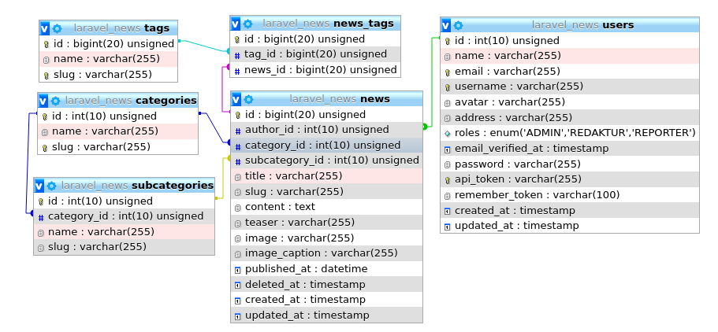

# [Laravel 5.8 News Management Api](https://github.com/lukisanjaya/news-management-laravel-api)

Laravel 5.8 REST API with JWT, Caching Redis, Api Resource, Repository Pattern.

## Installation

1. Install vendors composer :

```bash
composer install
```

2. Copy File .env.example to .env :

```bash
cp .env.example .env
```

3. Generate key :

```bash
php artisan key:generate
```

4. Setting your config database in .env file

5. Migrate Database :

```bash
php artisan migrate
```
6. Run Seeding database  :

```bash
php artisan db:seed --class=UserSeeder
```

7. Setting Cache driver in .env file:

```text
CACHE_DRIVER=redis
```

8. Run Your Program:

```text
php artisan serve
```

9. Open Your Browser [http://127.0.0.1:8000](http://127.0.0.1:8000), and you will see the news management api documentation.

```text
php artisan serve
```

## Scheme Database


## Login API

```text
Admin
email : admin@gmail.com
password : admin


Redaktur
email : redaktur@gmail.com
password : redaktur


Reporter
email : reporter@gmail.com
password : reporter
```
